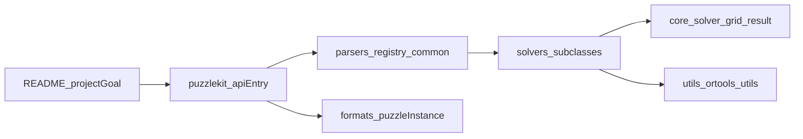

# PuzzleKit 代码审计报告（架构导向）

## 审计说明

- 审计范围：`src/puzzlekit/core/`、`src/puzzlekit/parsers/`、`src/puzzlekit/solvers/`、`src/puzzlekit/utils/`，并结合 `README.md` 评估项目初衷与实现一致性。
- 审计方式：按需抽样与主链路分析，不进行逐文件穷举。
- 排除范围：`assets/`、`penpa_edit/`、`pzprjs/`、`benchmark_results/`。
- 目标：给出当前状态判断、需求漂移识别、分优先级优化路线与后续深审计入口。

## 架构总览（主链路）

---

## 5.0 目前的项目状态、项目优缺点

### 当前项目状态（结论）

1. **项目定位明确**：`README.md` 将项目定义为“以 OR-Tools CP-SAT 为核心的逻辑谜题 Python 库”，并强调可编程 API 与结构化数据集。
2. **核心主链路清晰**：`src/puzzlekit/__init__.py` 中 `solve()` 形成 `parser -> solver -> result` 的统一入口，`decode/encode/convert` 形成 IR 转换路径。
3. **工程规模已进入中大型**：`solvers/` 存在大规模题型实现与统一注册；`parsers/registry.py` 也已形成完整映射表。
4. **文档与实现出现不同步**：`README.md` 与 `docs/index.md` 在能力数字与阶段描述上存在口径差异（见 5.1）。
5. **项目成熟度仍处于“能力强、治理弱”阶段**：算法能力增长快，工程治理（文档一致性、契约一致性、去重复）相对滞后。

### 优点

- **统一求解框架做得好**：`core/solver.py` 把建模、求解参数、状态归一化、分析指标统一封装，降低新增 solver 门槛。
- **公共约束层已经形成**：`utils/ortools_utils.py` 提供连通性、回路、flood-fill、MIP cut 等复用能力。
- **入口 API 设计友好**：`solve()` 兼容字符串和字典输入，`decode/encode/convert` 明确覆盖格式互转。
- **架构上具备平台化雏形**：求解与格式转换主链路清晰，具备继续扩展为“谜题基础设施”的潜力。

### 缺点

- **双注册表维护成本高**：`parsers/registry.py` 与 `solvers/__init__.py` 分别维护映射，新增题型容易漏配或漂移。
- **Parser 层重复较多**：`parsers/common.py` 里多类标准解析函数结构高度近似，长期易出现分叉行为。
- **核心契约边界偏松**：`PuzzleSolver.solve()` 依赖的关键子类方法未形成强契约约束，更多依赖运行时发现问题。
- **文档系统存在“可见性债务”**：README、站点首页与专题文档缺少稳定联动机制，影响对外可理解性与可信度。

---

## 5.1 目前存在的需求漂移、不足之处

### A. 产品叙事与实现状态漂移

1. **数量口径漂移**  
   `README.md`（100+ solver、41k+ 数据、130+题型）与 `docs/index.md`（90+、30k+）口径不一致，外部读者难以判断“当前真实能力”。

2. **转换能力表述与真实支持差异**  
   README 中 URL 互转类型数与代码中的题型映射来源（`formats/puzzle_types.py`）存在潜在偏差，建议统一以代码单一真源自动生成文档。

3. **Roadmap 与仓库现实不同步**  
   `README.md` 已明确“Docs update 未完成”，当前仓库状态也验证了这一点：技术能力扩展快于文档治理节奏。

### B. 架构与实现层漂移

1. **连通性建模存在多代并存**  
   `utils/ortools_utils.py` 同时存在旧式与新式连通性工具；`solvers/` 中调用方式并不统一，增加长期维护负担。

2. **输入契约不完全一致**  
   `parsers/common.py` 不同解析函数在空输入与异常处理上的策略并不完全统一（返回空结构、抛错、弱提示等并存）。

3. **结果对象承载边界偏宽**  
   `core/solver.py` 中 `PuzzleResult` 的 `puzzle_data` 来自 `vars(self).copy()`，容易混入运行态对象，边界不够“最小可依赖”。

### C. 现阶段不足（工程治理视角）

- 缺少“注册表一致性”自动检查，导致新增题型时的配置正确性依赖人工记忆。
- 缺少“parser 输出 vs solver 构造参数”的系统化契约测试，问题容易延后到运行时暴露。
- 文档入口较分散、口径不完全统一，会影响开源协作效率（贡献者上手成本更高）。

---

## 5.2 目前可以优化的方向（分步骤 + 优先级）

> 原则：先治理“正确性与一致性”，再治理“性能与扩展”，最后完善“生态体验”。

### P0（立即执行，1-2 周）

#### 步骤 1：统一对外事实口径（文档真源）
- 动作：
  - 对齐 `README.md`、`docs/index.md`、`mkdocs.yml` 的统计口径与能力描述。
  - 将“支持题型数量、solver 覆盖率、转换支持列表”改为从代码映射自动生成（或半自动脚本）。
- 预期收益：快速恢复项目可信度，降低外部误解成本。

#### 步骤 2：建立注册一致性守卫
- 动作：
  - 新增 CI 检查：`solvers` 注册类型是否都能在 `parsers/registry.py` 找到解析策略（反向也做检查）。
  - 对未知 puzzle type 给出明确失败信息。
- 预期收益：防止新增题型时“可求解但不可解析”或“可解析但不可求解”的断链。

#### 步骤 3：定义 parser 输出最小契约
- 动作：
  - 统一 parser 的空输入与错误行为（建议：非法输入一律抛 `ValueError`，禁止静默降级）。
  - 明确标准键名约定（例如统一 `num_rows/num_cols/grid` 与 region 相关字段）。
- 预期收益：降低运行时偶发现象，提高调试确定性。

### P1（短中期，2-4 周）

#### 步骤 4：收敛连通性建模 API
- 动作：
  - 梳理 `solvers/` 中连通性调用，统一迁移到一套稳定 API（并保留兼容层过渡）。
  - 为 `ortools_utils` 的关键函数补充单元测试（最小图、边界图、无解图）。
- 预期收益：减少重复建模和行为分叉，便于性能调优。

#### 步骤 5：拆分 `PuzzleResult` 的输入态与运行态
- 动作：
  - 用显式白名单替代 `vars(self).copy()`，只保留必要上下文字段。
  - 将可视化依赖从核心结果对象中进一步解耦（可保留便捷接口，但数据层清晰化）。
- 预期收益：提升序列化稳定性、可测试性和二次开发友好度。

#### 步骤 6：Parser 模板化去重
- 动作：
  - 将 `parsers/common.py` 的重复逻辑抽象为组合式 parse 步骤（header、grid、row/col clues、region）。
  - 保留少量特例 parser，避免“一刀切”重构。
- 预期收益：减少维护成本，降低修复一处漏改多处的风险。

### P2（中长期，4-8 周）

#### 步骤 7：统一 solve 主路径叙事
- 动作：
  - 在文档中明确：`solve()`（CP-SAT）作为主路径的覆盖边界与推荐场景。
  - 逐步评估是否将部分 parser 路径向 IR 路径汇聚，减少表示层割裂。
- 预期收益：架构认知一致，减少后续扩展时的“双轨维护”负担。

#### 步骤 8：建立性能基线与热点画像
- 动作：
  - 依赖现有 analytics 字段（如 `num_vars`、`num_constrs`、`build_time`、`wall_time`）建立题型分层基线。
  - 优先关注大图规模/高连通性约束题型（例如 flood-fill 与大区域连通问题）。
- 预期收益：优化动作从“经验驱动”转向“证据驱动”。

---

## 5.3 后续可以进一步详细审计、进一步优化的地方

### 方向 1：正确性审计（优先级最高）

- 针对 `parsers -> solver` 契约做系统抽样：参数缺失、类型偏差、边界输入。
- 增加“异常输入回归集”，覆盖空网格、尺寸不一致、非法符号、区域描述冲突等。
- 将核心不变量写成可执行测试（例如连通性约束的必要条件与充分性检查）。

### 方向 2：性能审计

- 建立按题型的约束规模剖面（变量/约束数量与求解时间关系）。
- 对高耗时题型做建模级 profiling，定位是“建模时间瓶颈”还是“搜索时间瓶颈”。
- 对通用工具函数进行 A/B 建模实验（统一基准样本和超参）。

### 方向 3：架构可演化性审计

- 评估 `core/` 与 `utils/` 的职责边界是否清晰，避免“工具层继续膨胀成第二核心层”。
- 评估 solver metadata 与文档生成链路，逐步形成“代码即文档真源”。
- 评估类型系统与静态检查策略，减少运行时才暴露的问题。

### 方向 4：开源协作治理审计

- 新增题型的贡献路径标准化（模板、检查清单、最小测试要求）。
- 文档站可构建性检查纳入 CI，避免导航指向不存在页面。
- 将“版本发布说明”与“能力变化日志”结构化，降低外部用户升级成本。

---

## 5.4 其他点评

1. **项目价值判断**  
   PuzzleKit 的核心价值并不只是“题型数量”，而是“统一求解框架 + 多格式转换 + 可编程入口”的组合能力；这在研究和自动化场景里具有长期潜力。

2. **当前关键矛盾**  
   主要矛盾已经从“有没有 solver”转为“如何把快速增长的 solver 体系治理成稳定平台”。现阶段最需要的是一致性工程，而非单点功能继续堆叠。

3. **建议的阶段目标**  
   先完成 P0 的一致性修复与文档对齐，再推进 P1 的抽象收敛；若顺序反过来，容易在不稳定基线上做过度重构。

4. **开源演进建议**  
   以“可验证、可复现、可贡献”为三条主线：  
   - 可验证：CI 覆盖注册一致性与契约测试；  
   - 可复现：统一基准与性能报告结构；  
   - 可贡献：明确新增题型的最小交付标准。

---

## 附录：本次审计重点参考文件

- `README.md`
- `mkdocs.yml`
- `docs/index.md`
- `docs/abstract.md`
- `src/puzzlekit/__init__.py`
- `src/puzzlekit/core/solver.py`
- `src/puzzlekit/parsers/registry.py`
- `src/puzzlekit/parsers/common.py`
- `src/puzzlekit/solvers/__init__.py`
- `src/puzzlekit/utils/ortools_utils.py`
